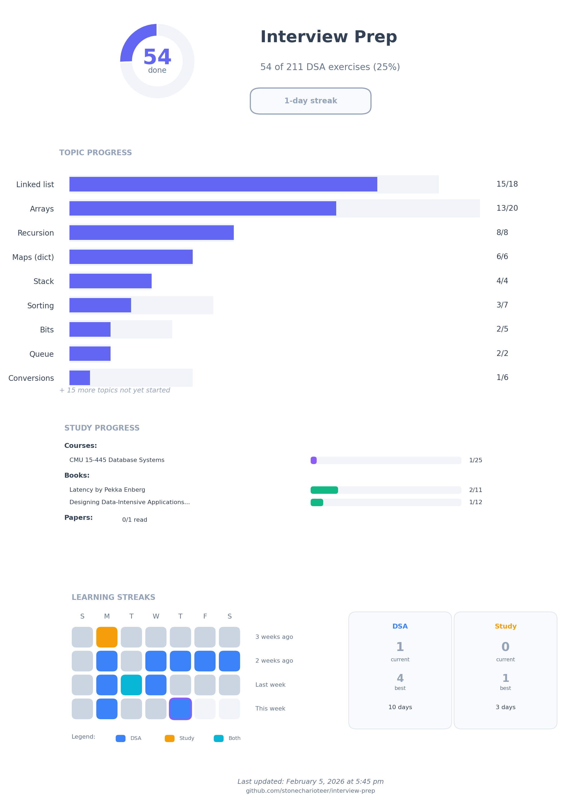

# Interview Prep



Practice solutions in Python, JavaScript (Node), and Rust, plus system design study tracking.

See [exercises.md](./exercises.md) for the full exercise list with progress tracking.

## Progress CLI

Track DSA exercises and system design studies using DuckDB.

```bash
just progress              # Show DSA summary
just progress cheatsheet   # Show quick reference
just progress --help       # See all commands
```

### DSA Exercises

```bash
just progress mark 28 python solved      # Mark as solved
just progress mark 28 python attempted   # Mark as attempted
just progress next python                # Next 10 unsolved
just progress list --topic Trees         # Filter by topic
```

### Study Tracking

Track books, courses, papers, and associated materials:

```bash
just progress study                      # Show study summary

# Books (chapter-level progress)
just progress study book-add "DDIA" --author "Kleppmann" --chapters 12
just progress study book-read 1 --chapter 1              # Mark ch 1 as 100%
just progress study book-read 1 --chapter 2 --progress 50  # Partial progress
just progress study book-read 1 --chapters "3-5"         # Mark range as 100%
just progress study book-show 1

# Courses with lectures, homework, and projects
just progress study course-add "Database Systems" --source CMU --code "15-445"
just progress study lecture-add 1 "Introduction" --number 1
just progress study watch 1 1
just progress study homework-add 1 "SQL Homework"
just progress study project-add 1 "Buffer Pool"
just progress study course-show 1

# Papers
just progress study paper-add "Dynamo" --authors "DeCandia et al." --year 2007
just progress study paper-read 1
```

### Output Files

```bash
just progress sync       # Update exercises.md + progress.png
just progress plot       # Update progress.png only
```

## Practice Notes

- Start with small, hand-written inputs before random data.
- For each function: note intent, edge cases, and time/space complexity.
- Keep each exercise as a single script file and avoid extra packaging.

## Goal

Be comfortable with:

- **Data structures**: arrays, linked lists, stacks, queues, trees (binary, BST), heaps, tries, graphs, Union-Find
- **Techniques**: two pointers, sliding window, binary search variations, monotonic stack
- **Algorithms**: sorting (comparison and non-comparison), recursion, backtracking, greedy, dynamic programming
- **Patterns**: string matching (KMP, Rabin-Karp), bit manipulation, graph traversals (BFS/DFS), shortest paths, MST
- **Problem-solving**: recognizing which technique fits which problem shape

## Tests

```bash
just run-tests              # All languages
just run-tests py           # Python only
just run-some-tests <filter> py  # With filter
```

## Dependencies

- uv
- rustup
- just
- gum
- node/npm
