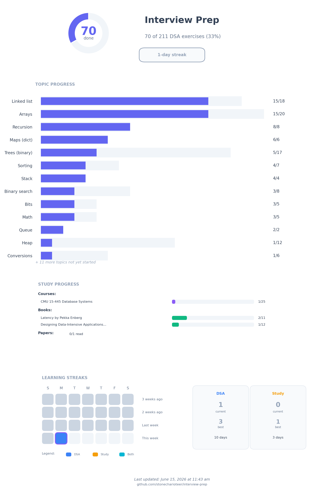

# DSA Practice



Practice solutions in Python, JavaScript (Node), and Rust under `dsa/`.

See [../exercises.md](../exercises.md) for the full exercise list with progress tracking.

## Progress CLI

Track DSA exercises and system design studies using DuckDB.

```bash
just progress              # Show DSA summary
just progress cheatsheet   # Show quick reference
just progress --help       # See all commands
```

### DSA Exercises

```bash
just progress mark 28 python solved      # Mark as solved
just progress mark 28 python attempted   # Mark as attempted
just progress next python                # Next 10 unsolved
just progress list --topic Trees         # Filter by topic
```

### Output Files

```bash
just progress sync       # Update exercises.md + progress.png
just progress plot       # Update progress.png only
```

## Practice Notes

- Start with small, hand-written inputs before random data.
- For each function: note intent, edge cases, and time/space complexity.
- Keep each exercise as a single script file and avoid extra packaging.

## Goal

Be comfortable with:

- **Data structures**: arrays, linked lists, stacks, queues, trees (binary, BST), heaps, tries, graphs, Union-Find
- **Techniques**: two pointers, sliding window, binary search variations, monotonic stack
- **Algorithms**: sorting (comparison and non-comparison), recursion, backtracking, greedy, dynamic programming
- **Patterns**: string matching (KMP, Rabin-Karp), bit manipulation, graph traversals (BFS/DFS), shortest paths, MST
- **Problem-solving**: recognizing which technique fits which problem shape

## Workflow

```bash
just setup                  # Install core deps + repo git hooks
just install-hooks          # Reinstall hooks after hook config changes
just setup-notebooks        # Optional notebook tooling
just fmt                    # Format Python, TS/JS/Markdown, and Rust
just lint                   # Ruff + Prettier + cargo fmt --check
just typecheck              # TypeScript typecheck
```

## Editor / Tooling Resolution

- Python tooling resolves against `dsa/python/.venv` via `pyrightconfig.json` and repo-local `.neoconf.json`.
- JavaScript tooling uses `pnpm` and the local install in `dsa/js/node_modules`.
- `dsa/js/.npmrc` disables accidental `package-lock.json` generation.

## Tests

```bash
just test all                # All languages
just test py                 # Python only
just test js                 # JavaScript/TypeScript via pnpm
just test rust               # Rust only
just test py arrays          # Filter Python tests
just test js "binary search" # Filter JS tests
```

## Dependencies

- uv
- rustup
- just
- gum
- pnpm
